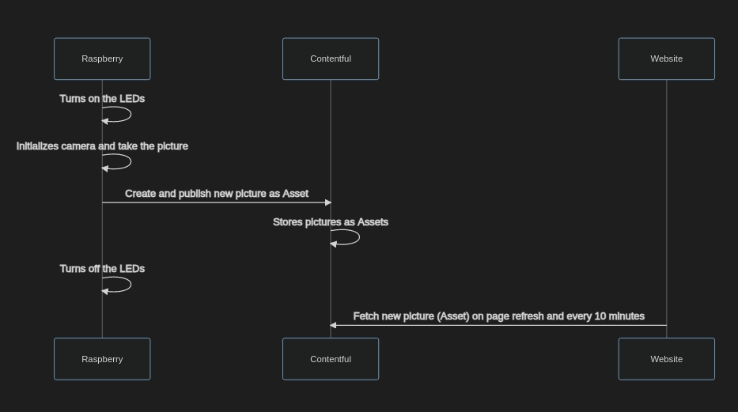

<h1 align="center">Raise your Blob - Experience 👋</h1>

    

# Intro

CNES proposes experiments based on the study of the behavior of Physarum Polycephalum or Blob in collaboration with the Alpha mission of Thomas Pesquet.

On Earth, 2 000 classes will follow Audrey Dussutour's protocols to reproduce the same experiments and transmit their results.

Here are the experiments performed by the classes of 5ème 1 & 5ème 2 of the Jean Moulin high school in Marseille

# Stack

## Raspberry

[See documentation](../raspberry/README.md)

## Website

[See documentation](../website/README.md)

## Contentful

Contentful is a headless content management system (CMS)

[See more](https://www.contentful.com/)

